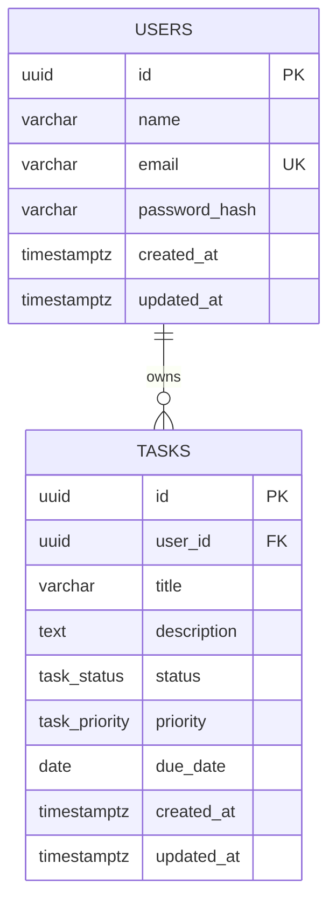

# Juno Data Model

## 1. Overview

Juno uses PostgreSQL as its relational database.

The MVP contains two primary entities:

- User
- Task

Each user can own multiple tasks, while each task belongs to exactly one user.

## 2. Entity Relationship Diagram



## 3. Users Table

Table name: `users`

| Column | PostgreSQL Type | Constraints | Description |
|---|---|---|---|
| `id` | `UUID` | Primary key | Unique user identifier |
| `name` | `VARCHAR(100)` | Not null | User's display name |
| `email` | `VARCHAR(255)` | Not null, unique | Normalized email address |
| `password_hash` | `VARCHAR(255)` | Not null | Securely hashed password |
| `created_at` | `TIMESTAMPTZ` | Not null, default current time | Account creation time |
| `updated_at` | `TIMESTAMPTZ` | Not null, default current time | Last account update time |

### User Rules

- Email addresses are converted to lowercase before storage.
- Raw passwords are never stored.
- Passwords are hashed before creating the user record.
- Two users cannot register with the same normalized email address.

## 4. Tasks Table

Table name: `tasks`

| Column | PostgreSQL Type | Constraints | Description |
|---|---|---|---|
| `id` | `UUID` | Primary key | Unique task identifier |
| `user_id` | `UUID` | Not null, foreign key | Owner of the task |
| `title` | `VARCHAR(200)` | Not null | Task title |
| `description` | `TEXT` | Nullable | Additional task details |
| `status` | `task_status` | Not null, default `todo` | Current task status |
| `priority` | `task_priority` | Not null, default `medium` | Task priority |
| `due_date` | `DATE` | Nullable | Optional completion date |
| `created_at` | `TIMESTAMPTZ` | Not null, default current time | Task creation time |
| `updated_at` | `TIMESTAMPTZ` | Not null, default current time | Last task update time |

### Task Rules

- Every task must belong to one user.
- The authenticated user's ID is taken from the verified JWT, not from request input.
- Users can read, update, and delete only their own tasks.
- Deleting a user also deletes that user's tasks.
- A task title cannot be empty.
- Description and due date are optional.
- The application updates `updated_at` whenever a task changes.

## 5. Task Status Enum

Database enum name: `task_status`

| Value | UI Label | Description |
|---|---|---|
| `todo` | To Do | Work has not started |
| `in_progress` | In Progress | Work is currently underway |
| `done` | Done | Work has been completed |

## 6. Task Priority Enum

Database enum name: `task_priority`

| Value | UI Label | Description |
|---|---|---|
| `low` | Low | Can be handled later |
| `medium` | Medium | Normal priority |
| `high` | High | Requires prompt attention |

## 7. Relationships

### User to Tasks

- Relationship type: one-to-many
- One user can own zero or many tasks.
- One task must belong to exactly one user.
- `tasks.user_id` references `users.id`.
- The foreign key uses `ON DELETE CASCADE`.

## 8. Database Indexes

The MVP should include indexes for:

- Unique user email lookup
- Task ownership through `user_id`
- Filtering by user and status
- Filtering by user and priority
- Sorting a user's tasks by creation date
- Sorting a user's tasks by due date

Suggested indexes:

- Unique index on `users.email`
- Index on `tasks.user_id`
- Composite index on `tasks(user_id, status)`
- Composite index on `tasks(user_id, priority)`
- Composite index on `tasks(user_id, created_at)`
- Composite index on `tasks(user_id, due_date)`

## 9. Dashboard Data

Dashboard statistics are calculated from the `tasks` table rather than stored separately.

For the authenticated user, the API calculates:

- Total task count
- To Do task count
- In Progress task count
- Done task count
- Completion percentage

Completion percentage:

```text
(done task count / total task count) x 100
```

When the user has no tasks, the completion percentage is `0`.

## 10. Naming Conventions

- PostgreSQL tables and columns use `snake_case`.
- TypeScript properties use `camelCase`.
- Database enum values use lowercase `snake_case`.
- API responses convert database fields into the application's TypeScript format.
