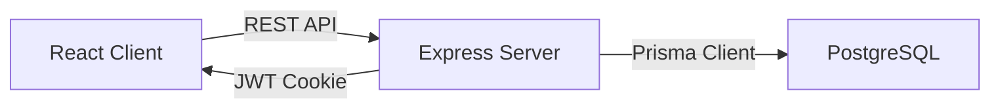

# Juno Technology Stack

## 1. Stack Overview

Juno is a TypeScript full-stack application with a React frontend, an Express REST API, and a PostgreSQL database.



## 2. Runtime and Package Manager

### Node.js

- Node.js 24 LTS
- Used by the frontend build tools and backend server
- An LTS release provides a stable production runtime

### Package Manager

- npm
- A root `package.json` coordinates the client and server
- Exact dependency versions are recorded in `package-lock.json`

## 3. Frontend

### Core

- React
- TypeScript
- Vite
- Tailwind CSS

### Application Libraries

- React Router for client-side routing
- TanStack Query for API state and caching
- React Hook Form for form state
- Zod for client-side validation

### Frontend Responsibilities

- Authentication screens
- Protected route handling
- Dashboard presentation
- Task forms and task lists
- Search, filter, and sort controls
- Loading, empty, success, and error states
- Responsive desktop and mobile layouts

## 4. Backend

### Core

- Node.js
- Express 5
- TypeScript
- REST APIs

### Backend Libraries

- Zod for request validation
- Prisma ORM for database access and migrations
- A JWT library for authentication tokens
- Argon2 for password hashing
- Helmet for security-related HTTP headers
- CORS middleware for allowed frontend origins
- Cookie parsing middleware for authentication cookies
- Rate limiting for authentication endpoints
- Pino for structured application logging

### Backend Responsibilities

- User registration and login
- JWT creation and verification
- Authorization and task ownership checks
- Task CRUD operations
- Search, filtering, and sorting
- Dashboard aggregation
- Input validation
- Consistent API errors
- Health checks and structured logging

## 5. Database

### PostgreSQL

PostgreSQL stores:

- User accounts
- Password hashes
- Tasks
- Task status and priority
- Timestamps and due dates

### Prisma ORM

Prisma provides:

- A declarative database schema
- Type-safe database queries
- Database migrations
- Relationship management
- Prisma Studio for inspecting development data

PostgreSQL is used from the beginning so local development and production use the same database system.

## 6. Authentication

Juno uses JWT authentication.

The planned authentication flow is:

1. The user submits an email and password.
2. The server validates the credentials.
3. The server creates a signed JWT.
4. The JWT is returned in an `HttpOnly` cookie.
5. The browser includes the cookie in authenticated requests.
6. Authentication middleware verifies the JWT.
7. The server obtains the user ID from the verified token.
8. Logout clears the authentication cookie.

The application does not store authentication tokens in local storage.

Production cookies use:

- `HttpOnly`
- `Secure`
- An appropriate `SameSite` policy

## 7. API Design

The backend exposes versioned REST endpoints under:

```text
/api/v1
```

Initial endpoint groups:

```text
/api/v1/auth
/api/v1/tasks
/api/v1/dashboard
/api/v1/health
```

API requests and responses use JSON.

The API follows consistent conventions for:

- HTTP status codes
- Validation errors
- Authentication errors
- Authorization errors
- Not-found errors
- Unexpected server errors

## 8. Testing

### Frontend

- Vitest
- React Testing Library

### Backend

- Vitest
- Supertest

### End-to-End

- Playwright

The MVP prioritizes tests for:

- Registration and login
- Protected routes
- Task ownership
- Task CRUD operations
- Search and filters
- Dashboard calculations

## 9. Development Quality

Juno uses:

- ESLint for static analysis
- Prettier for consistent formatting
- TypeScript strict mode
- Environment variable validation
- GitHub pull requests for reviewable changes
- GitHub Actions for automated checks

Automated checks will include:

- Type checking
- Linting
- Unit and integration tests
- Production builds

## 10. Docker

Docker Compose runs local infrastructure.

Initial services:

- PostgreSQL database
- Express API
- React client

During early development, the client and server may run directly on the host while PostgreSQL runs in Docker.

The completed application will support running the full stack through Docker Compose.

## 11. Environment Variables

Expected server variables:

```text
DATABASE_URL
JWT_SECRET
CLIENT_ORIGIN
PORT
NODE_ENV
```

Expected client variables:

```text
VITE_API_URL
```

Rules:

- `.env` files are never committed.
- `.env.example` documents required variables without real secrets.
- Production secrets are stored in the deployment platform.

## 12. Repository

```text
juno/
├── client/
│   ├── public/
│   ├── src/
│   │   ├── api/
│   │   ├── components/
│   │   ├── features/
│   │   ├── hooks/
│   │   ├── layouts/
│   │   ├── pages/
│   │   ├── routes/
│   │   └── types/
│   └── package.json
├── server/
│   ├── prisma/
│   ├── src/
│   │   ├── config/
│   │   ├── controllers/
│   │   ├── middleware/
│   │   ├── routes/
│   │   ├── services/
│   │   ├── validators/
│   │   └── lib/
│   ├── tests/
│   └── package.json
├── docs/
├── .env.example
├── docker-compose.yml
├── package.json
└── README.md
```

## 13. Architecture Decisions

### TypeScript Across the Stack

Using TypeScript in both the client and server reduces context switching and provides consistent types and tooling.

### Express Instead of FastAPI

Express keeps the frontend and backend in the same language while still demonstrating REST API design, middleware, authentication, and backend architecture.

### REST Instead of GraphQL

REST directly supports the project's learning goals and keeps the MVP focused.

### PostgreSQL Instead of SQLite

Using PostgreSQL from the beginning avoids differences between development and production database behavior.

### Separate Client and Server

The frontend and backend remain independently testable and deployable while living in one repository.
