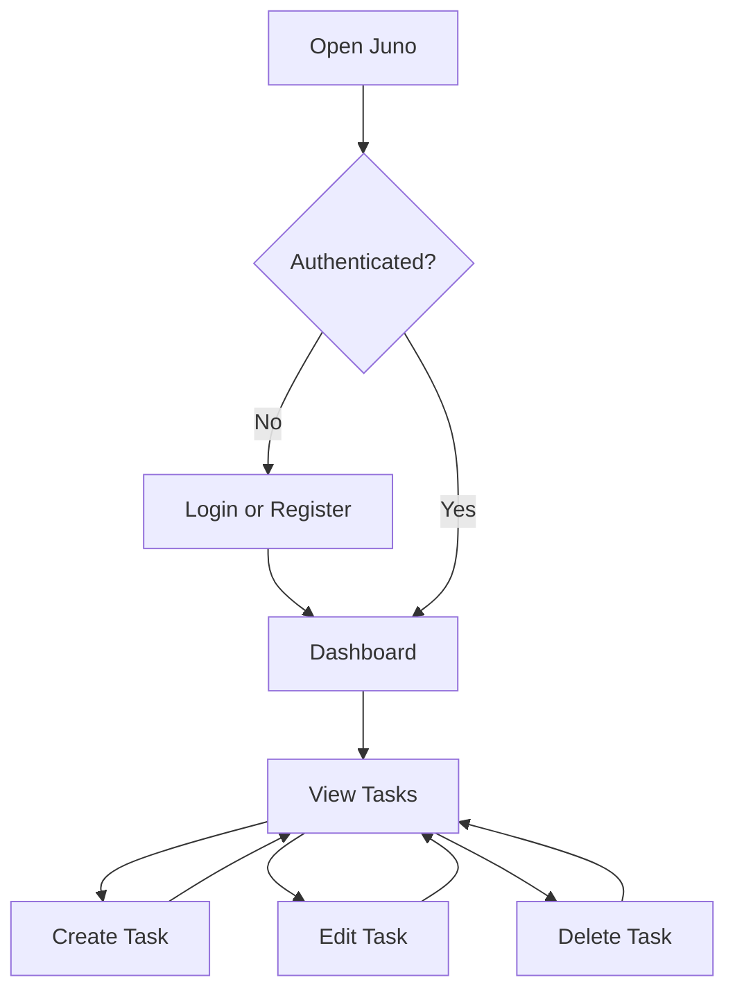

# Juno Wireframes and User Flows

## 1. Application Routes

### Public Routes

- `/login` - User login
- `/register` - User registration

### Protected Routes

- `/dashboard` - Task statistics and overview
- `/tasks` - Task list, search, filters, and sorting
- `/tasks/new` - Create a task
- `/tasks/:taskId/edit` - Edit a task

Unauthenticated users who visit a protected route are redirected to `/login`.

## 2. Primary User Flow



## 3. Application Shell

Desktop pages use a shared sidebar and header.

```text
+------------------+-----------------------------------------------+
| JUNO             | Page title                    User menu       |
|                  +-----------------------------------------------+
| Dashboard        |                                               |
| Tasks            | Main page content                             |
|                  |                                               |
|                  |                                               |
|                  |                                               |
| Sign Out         |                                               |
+------------------+-----------------------------------------------+
```

On mobile, the sidebar becomes a compact navigation menu.

## 4. Login Page

```text
+---------------------------------------------------------------+
|                                                               |
|                         JUNO                                  |
|                                                               |
|                  Welcome back                                 |
|                                                               |
|                  Email                                        |
|                  [________________________]                   |
|                                                               |
|                  Password                                     |
|                  [________________________]                   |
|                                                               |
|                  [       Sign In          ]                   |
|                                                               |
|                  Need an account? Register                    |
|                                                               |
+---------------------------------------------------------------+
```

## 5. Registration Page

```text
+---------------------------------------------------------------+
|                                                               |
|                         JUNO                                  |
|                                                               |
|                  Create your account                          |
|                                                               |
|                  Name                                         |
|                  [________________________]                   |
|                                                               |
|                  Email                                        |
|                  [________________________]                   |
|                                                               |
|                  Password                                     |
|                  [________________________]                   |
|                                                               |
|                  Confirm password                             |
|                  [________________________]                   |
|                                                               |
|                  [       Create Account    ]                  |
|                                                               |
|                  Already registered? Sign in                  |
|                                                               |
+---------------------------------------------------------------+
```

## 6. Dashboard Page

```text
+---------------------------------------------------------------+
| Dashboard                                      + New Task     |
+---------------------------------------------------------------+
| Total Tasks | To Do       | In Progress | Completed           |
|     12      |     5       |      3      |     4               |
+---------------------------------------------------------------+
|                                                               |
| Completion Progress                                           |
| [====================------------------------] 33%            |
|                                                               |
+---------------------------------------------------------------+
| Recent Tasks                                                  |
|                                                               |
| Finish project setup       High       In Progress             |
| Review API documentation   Medium     To Do                   |
| Update portfolio           Low        Done                    |
|                                                               |
|                         View all tasks                        |
+---------------------------------------------------------------+
```

## 7. Tasks Page

```text
+---------------------------------------------------------------+
| Tasks                                          + New Task     |
+---------------------------------------------------------------+
| Search tasks...                                               |
| [________________________]                                    |
|                                                               |
| Status: [All]   Priority: [All]   Sort: [Newest First]        |
+---------------------------------------------------------------+
| Task                     Status        Priority       Actions |
+---------------------------------------------------------------+
| Finish project setup     In Progress   High           Edit ⋮  |
| Review documentation     To Do         Medium         Edit ⋮  |
| Update portfolio         Done          Low            Edit ⋮  |
+---------------------------------------------------------------+
```

The actions menu contains:

- Edit
- Delete

Deleting a task requires confirmation.

## 8. Create and Edit Task Page

```text
+---------------------------------------------------------------+
| Create Task                                                   |
+---------------------------------------------------------------+
| Title                                                         |
| [___________________________________________________________] |
|                                                               |
| Description                                                   |
| [___________________________________________________________] |
| [___________________________________________________________] |
|                                                               |
| Status                   Priority                             |
| [To Do        v]         [Medium                   v]         |
|                                                               |
| Due Date                                                      |
| [mm/dd/yyyy]                                                  |
|                                                               |
|                         [Cancel] [Save Task]                  |
+---------------------------------------------------------------+
```

The edit page uses the same form with existing task values filled in.

## 9. Empty and Loading States

### Empty Task List

Display:

- A short message explaining that no tasks exist
- A `Create your first task` button

### No Search Results

Display:

- `No tasks match your search or filters`
- A `Clear filters` button

### Loading

Display skeleton placeholders while tasks and dashboard statistics load.

## 10. Responsive Behavior

- Desktop uses a persistent sidebar.
- Mobile uses a compact menu or bottom navigation.
- Dashboard cards stack vertically on small screens.
- Task table becomes a card list on mobile.
- Forms use full-width inputs on small screens.